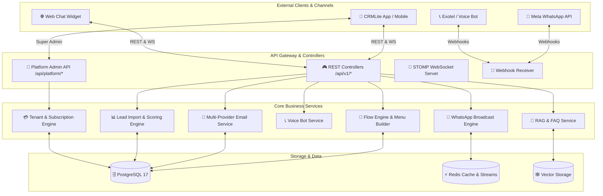
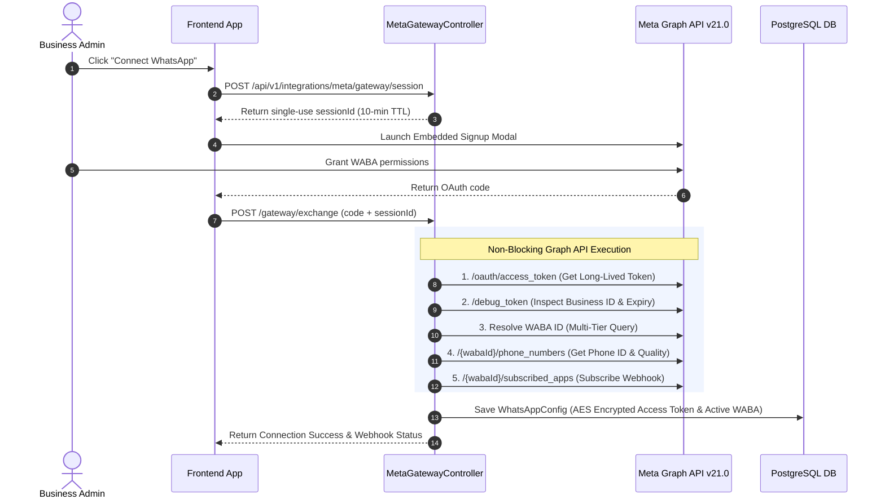

# 🚀 ChatCRM Lite Backend

> A modern, enterprise-grade WhatsApp & WebChat integrated CRM backend built with Spring Boot, PostgreSQL, Redis, and AI-powered RAG support.


---

## 📋 Table of Contents

- [🌟 About The Project](#-about-the-project)
- [🎯 Features](#-features)
- [🏗️ Architecture](#-architecture)
- [🔧 Tech Stack](#-tech-stack)
- [⚙️ Installation](#-installation)
- [🚀 Quick Start](#-quick-start)
- [🛠️ Recent Updates & New Functionality](#-recent-updates--new-functionality)
- [📊 API Endpoints](#-api-endpoints)
- [🐛 Troubleshooting](#-troubleshooting)
- [📁 Project Structure](#-project-structure)
- [📚 Documentation](#-documentation)
- [🔐 Security Features](#-security-features)
- [📝 Contributing](#-contributing)

---

## 🌟 About The Project

**CRMLite Backend** is a full-stack, multi-tenant CRM application engine powered by **Spring Boot 3.4** and **Java 21**, seamlessly integrated with Meta WhatsApp API, WebChat Widget, Voice/Telephony APIs, and AI-driven automation capabilities.

It automates customer interactions across multiple channels (WhatsApp, Web Chat Widget, Voice/IVR, Email), captures and scores leads in real time, manages multi-tier organization subscriptions, and provides both Tenant Administrators and Platform Super Admins with comprehensive management portals.

---

## 🎯 Features

### 🏢 Platform & Tenant Management
- 👑 **Super Admin Portal (`/api/platform/*`)** - System-wide administration, tenant lifecycle management, feature flag overrides, quota adjustments, platform analytics, and global audit logging.
- 💳 **Multi-tier Subscriptions & Quotas** - Support for FREE, MIN, PRO, and ENTERPRISE plans with dynamic quota enforcement on contacts, leads, emails, and WhatsApp messages.
- 🏷️ **Custom Widget Branding (White-Labeling)** - Custom UI branding, colors, and logo URLs for PRO/ENTERPRISE tenants.

### 💬 Multi-Channel Messaging & Automation
- ✅ **WhatsApp Meta API & Multi-Flow Menus** - Dynamic menu generation, button/list menu auto-scaling, stateful flow engine, and Meta Embedded Signup integration.
- 📣 **WhatsApp Broadcast & Campaign Engine** - Bulk WhatsApp broadcast dispatching, scheduled campaigns, template management with dynamic variables, and delivery/read analytics.
- 🌐 **Web Chat Widget API & WebSockets** - Embeddable website chat widget backend supporting guest visitor sessions, real-time STOMP WebSockets, and live agent takeover.
- 📞 **Voice Bot & Telephony Integration** - Exotel cloud telephony & IVR integration, call tracking, voice agent configuration, and voice chat response processing.

### 📧 Email Suite & Outreach
- 📧 **Multi-Provider Email Engine** - Custom SMTP, SendGrid, and Amazon SES integration with dynamic HTML email template rendering.
- 📊 **Email Tracking & Webhooks** - Open & click tracking pixels, bounce/delivery status webhook handlers, and test dispatches.

### 📊 Lead & Sales Intelligence
- 📥 **Lead Bulk Import Engine** - Asynchronous CSV/Excel bulk lead import with column mapping, validation, and duplicate detection.
- 🎯 **Automated Lead Scoring** - Dynamic AI and rule-based lead scoring based on interaction history, contact metadata, and deal value.
- 📅 **Appointments & Google Calendar Sync** - Full appointment booking system integrated with Google Calendar APIs.

### 🧠 AI & RAG Engine
- 🧠 **Vector RAG Engine & FAQ System** - Document ingestion (PDF, DOCX, TXT), vector embeddings, guardrail validation, and FAQ auto-resolution.
- 🤖 **AI Agent Fallback** - Intelligent AI agent takeover when human agents are offline or unassigned.

---

## 🏗️ Architecture

### Detailed System Design



---

## 🛠️ Recent Updates & New Functionality

### 🆕 1. Super Admin & Platform Portal (`/api/platform/*`)
- **Platform Control Center**: Full administrative suite for platform super-users to oversee all tenant accounts, subscription plans, platform search, and audit logs.
- **Tenant Feature Overrides**: Granular ability to override specific tenant entitlements, bypass quota limits, or suspend/reactivate tenants.
- **Platform Analytics**: Cross-tenant aggregated metrics on system usage, active users, messaging volumes, and revenue.

### 🆕 2. Web Chat Widget Backend (`/api/public/webchat/*` & `/api/public/chat/*`)
- **Public Visitor Chat**: APIs to power embeddable web chat widgets with anonymous session creation, chat history retrieval, and file attachment uploads.
- **Live Agent Handover**: Real-time STOMP WebSocket notification bridge allowing agents to seamlessly take over guest website conversations.

### 🆕 3. Voice Bot & Exotel Telephony Engine (`/api/v1/public/voice/*` & `/api/v1/exotel/*`)
- **Exotel Cloud Telephony**: Inbound call processing via Exophone webhooks (`POST /api/v1/exotel/incoming`). Returns ExoML XML with bidirectional audio `<Stream>` WebSocket endpoints.
- **Deepgram STT & TTS Pipeline**: Real-time Speech-to-Text (`nova-2`) and Text-to-Speech (`aura-stella-en`) conversion for web/mobile voice visitors.
- **Voice AI Tools & Session Management**: Automated voice tool execution (`CreateLeadTool`, RAG knowledge retrieval) and rate-limiting per client IP.
- **Voice Configuration**: Per-tenant voice agent persona, speed, pitch, speech normalization, and call route management (`VoiceConfigController`).

```mermaid
sequenceDiagram
    autonumber
    actor Caller as Customer / Visitor
    participant Exotel as Exotel Cloud Telephony
    participant BE as Spring Boot Backend
    participant AI as Deepgram STT/TTS Engine

    rect rgb(245, 240, 255)
        Note over Caller,BE: Option 1: Exotel Cloud Phone Call Flow
        Caller->>Exotel: Dial Exophone Number
        Exotel->>BE: POST /api/v1/exotel/incoming (CallSid, From, To)
        BE-->>Exotel: Return ExoML XML (<Stream url="wss://.../ws/exotel/stream">)
        Exotel<->>BE: Establish Bidirectional Audio WebSocket Stream
    end

    rect rgb(240, 250, 245)
        Note over Caller,BE: Option 2: Public Web/Mobile Voice Chat AI
        Caller->>BE: POST /api/v1/public/voice/{businessId} (Audio File)
        BE->>AI: Deepgram STT (nova-2 model)
        AI-->>BE: Transcribed Text
        BE->>BE: Execute Voice AI Tools & Normalizer
        BE->>AI: Deepgram TTS (aura-stella-en model)
        AI-->>BE: Audio Binary / Base64
        BE-->>Caller: AI Voice Response Audio
    end
```

### 🆕 4. WhatsApp Coexistence & Embedded Signup (`/api/v1/integrations/meta/gateway/*`)
- **WhatsApp Coexistence**: Connect existing WhatsApp Business App numbers directly to Meta Cloud API without deleting the app or losing chat history.
- **Embedded Signup OAuth**: Automated Meta OAuth flow (`/session`, `/launch`, `/exchange`) exchanging authorization codes for long-lived system tokens.
- **Single-Use Session Protection**: 10-minute TTL opaque `sessionId` binding onboarding sessions to the tenant ID to prevent replay attacks.
- **Multi-Tier WABA Resolution**: Automated 4-tier fallback querying (`owned_whatsapp_business_accounts` -> `client_whatsapp_business_accounts` -> `/debug_token` target_ids -> `/me/whatsapp_business_accounts`) to reliably identify the WABA ID.
- **Automatic Webhook Registration**: Instant subscription of the connected WABA to Meta App webhooks (`subscribed_apps`) with auto-generated verify tokens and isolated connection vs webhook status tracking (`/retry-webhook`).
- **AES Token Encryption**: Access tokens are automatically AES-encrypted at rest in PostgreSQL (`WhatsAppConfig`).



### 🆕 5. WhatsApp Broadcast & Campaign Engine (`/api/v1/whatsapp/campaigns/*`)
- **Targeted Broadcasts**: Send bulk WhatsApp messages to contact segments with dynamic merge fields.
- **Campaign Analytics**: Real-time tracking of sent, delivered, read, and failed message statuses.
- **Template Management**: Create, sync, and submit WhatsApp message templates to Meta for approval.

### 🆕 6. Advanced Email Engine & Webhooks (`/api/v1/emails/*` & `/api/v1/email-tracking/*`)
- **Multi-Provider SMTP**: Configure tenant-specific SMTP servers, SendGrid, or Amazon SES credentials.
- **Email Tracking**: Open rate tracking pixels and click-through redirect tracking.
- **Delivery Webhooks**: Process bounce, spam report, and delivery confirmation webhooks.

### 🆕 7. Lead Bulk Import & Intelligent Lead Scoring (`/api/v1/leads/bulk-upload` & `/api/v1/lead-scoring/*`)
- **Async Bulk Upload**: Process large CSV/Excel spreadsheets of leads with field mapping and validation.
- **Dynamic Lead Scoring**: Auto-compute lead engagement scores based on customer activity, interaction frequency, and pipeline stage.

### 🆕 8. FAQ & RAG Knowledge Base (`/api/v1/knowledge-base/*` & `/api/v1/faqs/*`)
- **Document Vectorization**: Upload PDF/DOCX files to generate vector embeddings for intelligent bot retrieval.
- **FAQ Auto-Matching**: Search indexed FAQ knowledge bases to answer customer queries accurately before escalating to human agents.

### 🆕 9. Multi-tier Subscriptions & White-Label Branding
- **Tier Quota Enforcement**: FREE, MIN, PRO, and ENTERPRISE plans with automated lifecycle downgrades upon expiry.
- **Custom Widget Branding**: Custom colors, logo URLs, and removal of default watermarks for PRO/ENTERPRISE tiers.

---

## 📊 API Endpoints

### 👑 Super Admin / Platform Portal
```
POST   /api/platform/auth/login             🔑 Platform admin login
GET    /api/platform/tenants                🏢 List all tenants
POST   /api/platform/tenants                ➕ Create tenant
GET    /api/platform/tenants/{id}/overrides 🎛️  Tenant feature overrides
POST   /api/platform/plans                  💳 Manage subscription plans
GET    /api/platform/analytics              📊 Platform aggregated analytics
GET    /api/platform/audit-logs             📜 System audit logs
```

### 🔐 Authentication & Onboarding
```
POST   /api/v1/auth/login                   🔑 User login
POST   /api/v1/auth/register                📝 Register user & tenant
POST   /api/v1/auth/refresh                 🔄 Refresh JWT token
GET    /api/v1/onboarding/status            🚀 Onboarding setup status
```

### 📲 Meta WhatsApp Embedded Signup & Gateway
```
POST   /api/v1/integrations/meta/gateway/session        🔑 Create onboarding session ID
GET    /api/v1/integrations/meta/gateway/launch         🚀 Server-rendered Meta launch modal
POST   /api/v1/integrations/meta/gateway/exchange       ⚡ Exchange OAuth code & auto-provision WABA
GET    /api/v1/integrations/meta/gateway/status         📊 Check connection & webhook status
POST   /api/v1/integrations/meta/gateway/retry-webhook  🔄 Retry Webhook subscription
```

### 📋 Leads & Sales Pipeline
```
GET    /api/v1/leads                        📋 List leads
POST   /api/v1/leads                        ✨ Create lead
PATCH  /api/v1/leads/{id}/status            🔄 Update lead status
POST   /api/v1/leads/bulk-upload            📥 Async CSV bulk lead import
GET    /api/v1/lead-scoring/rules           🎯 Lead scoring rules
```

### 💬 Messaging & WebChat Widget
```
GET    /api/v1/messages/chats               💬 Active conversations
GET    /api/v1/messages/{contactId}         📨 Chat history
POST   /api/v1/messages/{contactId}         ✉️  Send agent message
POST   /api/public/webchat/session          🌐 Init visitor webchat session
GET    /api/public/webchat/history          📜 Webchat message history
```

### 📱 WhatsApp & Campaigns
```
GET    /api/v1/whatsapp/config              ⚙️ WhatsApp credentials & status
POST   /api/v1/whatsapp/campaigns           📣 Create broadcast campaign
POST   /api/v1/whatsapp/campaigns/{id}/send 🚀 Execute campaign dispatch
GET    /api/v1/whatsapp/templates           📋 Message templates
POST   /api/v1/whatsapp/webhook             🔗 Meta webhook callback
```

### 📞 Voice & Telephony
```
GET    /api/v1/voice-config                 ⚙️ Voice bot config
POST   /api/public/voice/chat               📞 Voice bot interaction handler
POST   /api/v1/exotel/webhook               🔗 Exotel call event webhook
```

### 📧 Email Engine & Tracking
```
POST   /api/v1/emails/send                  ✉️ Send custom email
GET    /api/v1/email-templates              📄 List email templates
GET    /api/v1/email-providers              ⚙️ Configured email providers
GET    /api/v1/email-tracking/pixel/{id}   👁️ Email open tracking pixel
```

### 🧠 Knowledge Base & RAG
```
GET    /api/v1/knowledge-base               📚 List knowledge documents
POST   /api/v1/knowledge-base/upload        📤 Upload PDF/DOCX for RAG
GET    /api/v1/faqs                         ❓ List FAQ entries
POST   /api/v1/rag/query                    🔍 RAG vector query
```

### 📅 Appointments & Support Tickets
```
GET    /api/v1/appointments                 📅 List appointments
POST   /api/v1/appointments                 ➕ Book appointment
GET    /api/v1/tickets                      🎫 Support tickets
POST   /api/v1/support-forms/config         📝 Dynamic form configuration
```

---

## 🔧 Tech Stack

| Layer | Technology | Version |
|-------|-----------|---------|
| **Runtime** | Java | 21 |
| **Framework** | Spring Boot | 3.4.0 |
| **Data** | PostgreSQL + pgvector | 17 |
| **Cache & Bus** | Redis | Latest |
| **Security** | Spring Security + JWT | 6.x |
| **WebSockets** | Spring STOMP | 3.4.0 |
| **Telephony** | Exotel Cloud API | REST |
| **Container** | Docker & Docker Compose | Latest |

---

## ⚙️ Installation

### 📋 Prerequisites
```bash
✅ Java 21+
✅ Maven 3.8+
✅ PostgreSQL 17+ (with vector extension)
✅ Redis
✅ Docker & Docker Compose (optional)
```

### 1️⃣ Clone Repository
```bash
git clone https://github.com/hkbharti77/CRMLiteBackedn.git
cd CRMLiteBackedn
```

### 2️⃣ Configure Environment
```bash
cp .env.example .env
# Edit .env with your credentials
```

### 3️⃣ Build & Start
```bash
mvn clean install -DskipTests
docker-compose up -d postgres redis
mvn spring-boot:run
```

✅ **Server running on** `http://localhost:8080`

---

## 🚀 Quick Start

### 🔐 API Authentication
```bash
curl -X POST http://localhost:8080/api/v1/auth/login \
  -H "Content-Type: application/json" \
  -d '{
    "email": "user@example.com",
    "password": "password123"
  }'
```

### ⚡ WebSocket Connection
```javascript
const ws = new WebSocket('ws://localhost:8080/ws/chat');

ws.onmessage = (event) => {
  console.log('📨 Message:', event.data);
};

ws.send(JSON.stringify({
  type: 'MESSAGE',
  contactId: 'uuid',
  content: 'Hello! 👋'
}));
```

---

## 🐛 Troubleshooting

### ❌ Database Connection Timeout
```bash
docker-compose ps
cat .env | grep DATABASE_URL
```

### ❌ WebSocket Connection Failed
Ensure port `8080` is open and CORS settings permit web socket upgrades.

---

## 📁 Project Structure

```
CRMLiteBackedn/
├── src/main/java/com/chatcrmlite/backend/
│   ├── controllers/          # 🎮 REST endpoints (Tenant & Public)
│   │   ├── admin/            # 🏢 Tenant admin endpoints
│   │   ├── platform/         # 👑 Super Admin Platform endpoints
│   │   └── dev/              # 🧪 Dev & Sandbox endpoints
│   ├── services/             # ⚙️ Business logic & flows
│   ├── repositories/         # 🗄️ JPA repositories
│   ├── models/               # 📦 Entity models
│   ├── dto/ & dtos/          # 📨 Data transfer objects
│   ├── security/             # 🔐 JWT & Security filters
│   └── websocket/            # 🔌 STOMP WebSockets
├── src/main/resources/
│   ├── application.yml       # 🔧 Configuration
│   └── db/migration/         # 📝 Database migrations
├── docker-compose.yml        # 🐳 Dev services
└── README.md                 # 📖 Documentation
```

---

## 📝 Contributing

```bash
git checkout -b feature/your-feature
mvn clean test
git commit -m "feat: add new feature"
git push origin feature/your-feature
```

---

## 📄 License

📜 This project is licensed under the MIT License - see the LICENSE file for details.

---

<div align="center">

### ❤️ Made with ❤️ by the ChatCRM Team

⭐ **Star us on GitHub** if this project helped you!

</div>
