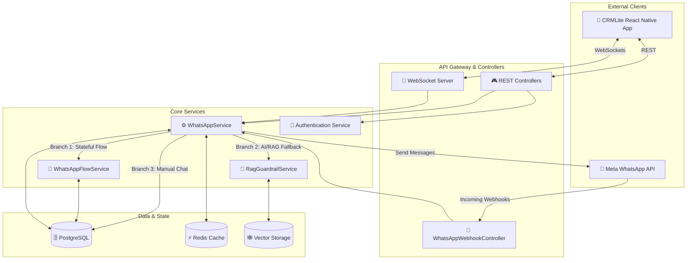

# 🚀 ChatCRM Lite Backend

> A modern, scalable WhatsApp-integrated CRM backend built with Spring Boot, PostgreSQL, and real-time WebSocket support.


---

## 📋 Table of Contents

- [🌟 About The Project](#-about-the-project)
- [🎯 Features](#-features)
- [🏗️ Architecture](#-architecture)
- [🔧 Tech Stack](#-tech-stack)
- [⚙️ Installation](#-installation)
- [🚀 Quick Start](#-quick-start)
- [🛠️ Recent Updates](#-recent-updates)
- [📊 API Endpoints](#-api-endpoints)
- [🐛 Troubleshooting](#-troubleshooting)
- [📝 Contributing](#-contributing)

---

## 🌟 About The Project

**CRMLite** is a full-stack, multi-tenant CRM application powered by Spring Boot and React Native, seamlessly integrated with the Meta WhatsApp API. It automates customer interactions through dynamic WhatsApp menus, captures leads in real-time, and provides business owners with a centralized mobile dashboard to manage chats, appointments, and support tickets, significantly boosting their operational efficiency.

### 💡 How it works:
- **Customer Side:** Customers interact with a business directly through WhatsApp—no app download required. The backend automatically replies with dynamic, interactive WhatsApp menus (e.g., "Book Appointment", "Get Support").
- **Business Side:** Business owners use the CRMLite mobile app to monitor live chats, manage auto-captured leads, and reply to customers in real-time using WebSockets. 
- **Automation:** It offers 24/7 automation, ensuring that businesses never miss a potential lead, even outside working hours.

---

## 🎯 Features

### Core Functionality
- ✅ **WhatsApp Integration** - Direct WhatsApp API integration for messaging
- ✅ **Lead Management** - Create, track, and manage leads with full lifecycle
- ✅ **Contact Management** - Organize contacts with tags and custom fields
- ✅ **Real-time Chat** - WebSocket-based real-time messaging
- ✅ **AI-Powered RAG** - Vector storage and retrieval-augmented generation
- ✅ **Multi-tenant Support** - Full isolation between organizations
- ✅ **Event System** - Event-driven architecture with webhooks

### Technical Excellence
- 🔐 **Enterprise Security** - JWT authentication, CORS, rate limiting
- 📈 **Scalability** - Horizontal scaling ready with Redis caching
- 🔄 **Resilience** - Circuit breakers, retry policies, graceful degradation
- 📊 **Observability** - Distributed tracing, metrics, structured logging
- 🧪 **Quality** - Comprehensive test coverage, code quality standards

---

## 🏗️ Architecture

### Detailed System Design



### Backend Architecture

```
┌─────────────────────────────────────────────────────────────┐
│                    API Gateway / Load Balancer               │
└─────────────────────────────────────────────────────────────┘
                              │
        ┌─────────────────────┼─────────────────────┐
        │                     │                     │
   ┌─────────┐         ┌─────────────┐       ┌──────────┐
   │ REST    │         │ WebSocket   │       │ Webhooks │
   │ API     │         │ Server      │       │ Receiver │
   └─────────┘         └─────────────┘       └──────────┘
        │                     │                     │
        └─────────────────────┼─────────────────────┘
                              │
        ┌─────────────────────┼─────────────────────┐
        │                     │                     │
   ┌──────────────┐  ┌──────────────┐  ┌──────────────┐
   │ Service      │  │ Repository   │  │ Cache Layer  │
   │ Layer        │  │ (Data Access)│  │ (Redis)      │
   └──────────────┘  └──────────────┘  └──────────────┘
        │                     │                     │
        └─────────────────────┼─────────────────────┘
                              │
                    ┌─────────────────────┐
                    │  PostgreSQL Database │
                    │  + Vector Storage   │
                    └─────────────────────┘
```

---

## 🔧 Tech Stack

| Layer | Technology | Version |
|-------|-----------|---------|
| **Runtime** | Java | 21 |
| **Framework** | Spring Boot | 3.4.0 |
| **Data** | PostgreSQL | 17.10 |
| **Cache** | Redis | Latest |
| **Messaging** | RabbitMQ | Optional |
| **Container** | Docker | Latest |
| **Orchestration** | Kubernetes | v1.28+ |
| **Monitoring** | Prometheus + Grafana | Latest |
| **Tracing** | Jaeger | Latest |

---

## ⚙️ Installation

### 📋 Prerequisites
```bash
✅ Java 21+
✅ Maven 3.8+
✅ PostgreSQL 17+
✅ Docker & Docker Compose (optional)
✅ Git
```

### 1️⃣ Clone Repository
```bash
git clone https://github.com/hkbharti77/CRMLiteBackedn.git
cd CRMLiteBackedn
```

### 2️⃣ Configure Environment
```bash
cp .env.example .env
# Edit .env with your settings
```

### 3️⃣ Build Project
```bash
mvn clean install -DskipTests
```

### 4️⃣ Start Database
```bash
docker-compose -f docker-compose.yml up -d postgres redis
```

### 5️⃣ Run Application
```bash
mvn spring-boot:run
```

✅ **Server running on** `http://localhost:8080`

---

## 🚀 Quick Start

### 🔐 API Authentication
```bash
# 🔑 Get JWT Token
curl -X POST http://localhost:8080/api/v1/auth/login \
  -H "Content-Type: application/json" \
  -d '{
    "email": "user@example.com",
    "password": "password123"
  }'
```

### 👥 Create a Lead
```bash
curl -X POST http://localhost:8080/api/v1/leads \
  -H "Authorization: Bearer YOUR_JWT_TOKEN" \
  -H "Content-Type: application/json" \
  -d '{
    "contactId": "contact-uuid",
    "status": "NEW",
    "dealValue": 5000,
    "currency": "INR"
  }'
```

### ⚡ WebSocket Connection
```javascript
// 🔗 Connect to real-time chat
const ws = new WebSocket('ws://localhost:8080/ws/chat');

ws.onmessage = (event) => {
  console.log('📨 Message:', event.data);
};

ws.send(JSON.stringify({
  type: 'MESSAGE',
  contactId: 'uuid',
  content: 'Hello! 👋'
}));
```

---

## 🛠️ Recent Updates

### 🔥 WhatsApp Multi-Flow Dynamic Menus (Latest)

#### Feature 📱
Added full support for concurrently hosting multiple business modules (Leads, Appointments, Bookings) within the same WhatsApp interaction menu.

#### Enhancements ✅
- **Dynamic Module Aggregation**: Backend automatically determines the tenant's primary flow based on their business category and forcefully merges it with any additional modules toggled via the frontend.
- **Smart Menu Scaling**: If the total number of menu options exceeds WhatsApp's limit of 3 buttons, the backend automatically converts the `interactive` message type from a Button Menu to a List Menu.
- **Backwards Compatibility**: Custom JSON menus saved previously are automatically parsed, and single hardcoded `trigger_flow` buttons are dynamically expanded to include all active modules.

---

## 📊 API Endpoints

### 🔐 Authentication
```
POST   /api/v1/auth/login              🔑 User login
POST   /api/v1/auth/register           📝 New registration
POST   /api/v1/auth/logout             🚪 Logout
POST   /api/v1/auth/refresh            🔄 Refresh token
```

### 📋 Leads
```
GET    /api/v1/leads                   📋 All leads
GET    /api/v1/leads/paged             📄 Paginated leads
POST   /api/v1/leads                   ✨ Create lead
PATCH  /api/v1/leads/{id}/status       🔄 Update status
PATCH  /api/v1/leads/{id}/deal         💰 Update deal
```

### 💬 Messages
```
GET    /api/v1/messages/chats          💬 Active chats
GET    /api/v1/messages/{contactId}    📨 Chat history
POST   /api/v1/messages/{contactId}    ✉️  Send message
```

### 👥 Contacts
```
GET    /api/v1/contacts                👥 All contacts
POST   /api/v1/contacts                ➕ New contact
PUT    /api/v1/contacts/{id}           ✏️  Update contact
DELETE /api/v1/contacts/{id}           ❌ Delete contact
```

---

## 🐛 Troubleshooting

### ❌ LazyInitializationException
```
🚨 Error: failed to lazily initialize a collection
```
**✅ Solution:** Ensure all controller endpoints have `@Transactional(readOnly=true)`

### ❌ Database Connection Timeout
```
🚨 Error: Could not connect to PostgreSQL
```
**✅ Solution:**
```bash
# 🔍 Check database is running
docker-compose ps

# ✓ Verify .env DATABASE_URL is correct
cat .env | grep DATABASE_URL
```

### ❌ WebSocket Connection Failed
```
🚨 Error: Failed to establish WebSocket connection
```
**✅ Solution:** Check firewall, ensure port 8080 is open

### ❌ Out of Memory
```
🚨 Error: Java heap space
```
**✅ Solution:**
```bash
export JAVA_OPTS="-Xmx2g -Xms1g"
mvn spring-boot:run
```

---

## 📁 Project Structure

```
CRMLiteBackedn/
├── src/main/java/
│   ├── controllers/          # 🎮 REST endpoints
│   ├── services/             # ⚙️  Business logic
│   ├── repositories/         # 🗄️  Data access
│   ├── models/               # 📦 Entity classes
│   ├── dto/                  # 📨 Data transfer objects
│   ├── security/             # 🔐 Authentication
│   └── events/               # 📡 Event system
├── src/main/resources/
│   ├── application.yml       # 🔧 Configuration
│   ├── db/migration/         # 📝 Flyway migrations
│   └── logback-spring.xml    # 📋 Logging config
├── docs/
│   ├── architecture/         # 🏗️  Architecture documentation
│   ├── audit/                # 🔍 Audit reports
│   ├── sre/                  # 🚨 SRE & Operations
│   └── deep_systems_audit/   # 📊 Advanced analysis
├── deployment/
│   ├── k8s/                  # ☸️  Kubernetes configs
│   ├── terraform/            # 🔧 Infrastructure as Code
│   ├── argocd/               # 🔄 GitOps configuration
│   └── edge-router/          # 🌐 Edge routing
├── monitoring/
│   ├── alert_rules.yml       # 🚨 Alert rules
│   ├── prometheus.yml        # 📊 Prometheus config
│   ├── grafana/              # 📈 Grafana dashboards
│   └── tempo.yml             # 🔍 Distributed tracing
├── docker-compose.yml        # 🐳 Docker services
├── docker-compose-monitoring.yml  # 📊 Monitoring stack
├── docker-compose.production.yml  # 🚀 Production setup
├── pom.xml                   # 📦 Maven config
└── README.md                 # 📖 This file
```

---

## 📚 Documentation

### System & Architecture Documentation
Comprehensive documentation of system architecture, deployment, and operational procedures:

- **[ARCHITECTURE_AUDIT.md](./docs/audit/ARCHITECTURE_AUDIT.md)** - 🏗️ Complete system architecture analysis
- **[TECH_STACK.md](./docs/audit/TECH_STACK.md)** - 📊 Technology stack overview and decisions
- **[DISTRIBUTED_SYSTEMS_AUDIT.md](./docs/deep_systems_audit/DISTRIBUTED_SYSTEMS_AUDIT.md)** - 🌐 Distributed system considerations
- **[PRODUCTION_READINESS_REPORT.md](./docs/audit/PRODUCTION_READINESS_REPORT.md)** - ✅ Production deployment checklist

### Operational & SRE Documentation
- **[SRE README](./docs/sre/README.md)** - 🚨 Site Reliability Engineering guide
- **[Alert Rules](./docs/sre/alerts/critical_alerts.yml)** - 🔔 Critical alerting configuration
- **[Runbooks](./docs/sre/runbooks/)** - 📋 Operational runbooks for common incidents
  - [AI Outage Response](./docs/sre/runbooks/AIOutage.md) - ⚡ AI service recovery
  - [Database Exhaustion](./docs/sre/runbooks/DBExhaustion.md) - 🗄️ DB recovery
  - [Queue Overload](./docs/sre/runbooks/QueueOverload.md) - 📦 Queue management
  - [Redis Failure](./docs/sre/runbooks/RedisFailure.md) - 💾 Cache recovery
  - [Webhook Failure](./docs/sre/runbooks/WebhookFailure.md) - 🔗 Webhook recovery

### Deployment & Infrastructure
- **[Kubernetes Manifests](./deployment/k8s/)** - ☸️ K8s deployment configurations
- **[Terraform Infrastructure](./deployment/terraform/)** - 🔧 Infrastructure as Code
- **[Docker Compose](./docker-compose.yml)** - 🐳 Local development setup
- **[Helm Charts](./blueprints/helm/)** - 📦 Helm chart values and configurations

---

## 🔐 Security Features

- ✅ JWT Authentication with refresh tokens
- ✅ CORS protection with origin validation
- ✅ Rate limiting (10 req/min per user)
- ✅ SQL injection prevention (parameterized queries)
- ✅ XSS protection with output encoding
- ✅ CSRF tokens on state-changing operations
- ✅ Password hashing with BCrypt
- ✅ API key rotation mechanism

---

## 📝 Contributing

### 🔄 Development Workflow
```bash
# 1️⃣ Create feature branch
git checkout -b feature/your-feature

# 2️⃣ Make changes
# 3️⃣ Run tests
mvn clean test

# 4️⃣ Commit with conventional messages
git commit -m "feat: add new feature"

# 5️⃣ Push and create PR
git push origin feature/your-feature
```

### ✅ Code Standards
- ✅ Java 21+ features
- ✅ Spring Boot best practices
- ✅ Consistent naming conventions
- ✅ Comprehensive javadoc
- ✅ Unit test coverage >80%

---

## 📞 Support

| Channel | Link |
|---------|------|
| 🐛 Issues | [GitHub Issues](https://github.com/hkbharti77/CRMLiteBackedn/issues) |
| 💬 Discussions | [GitHub Discussions](https://github.com/hkbharti77/CRMLiteBackedn/discussions) |
| 📧 Email | hkbharti77@gmail.com |

---

## 📄 License

📜 This project is licensed under the MIT License - see the LICENSE file for details.

---

## 🙏 Acknowledgments

- 🙌 Spring Boot community for excellent framework
- 🙌 PostgreSQL for reliable database
- 🙌 All contributors and users

---

<div align="center">

### ❤️ Made with ❤️ by the ChatCRM Team

⭐ **Star us on GitHub** if this project helped you!

[GitHub](https://github.com/hkbharti77/CRMLiteBackedn) · [Issues](https://github.com/hkbharti77/CRMLiteBackedn/issues) · [Discussions](https://github.com/hkbharti77/CRMLiteBackedn/discussions)

**Questions?** Open an issue or start a discussion! 💬

**Happy Coding!** 🚀

</div>
